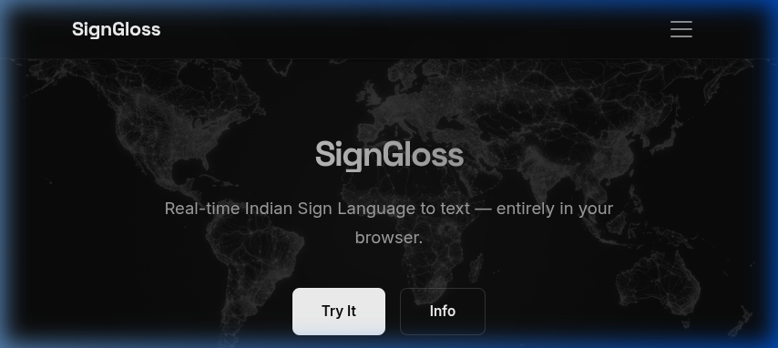
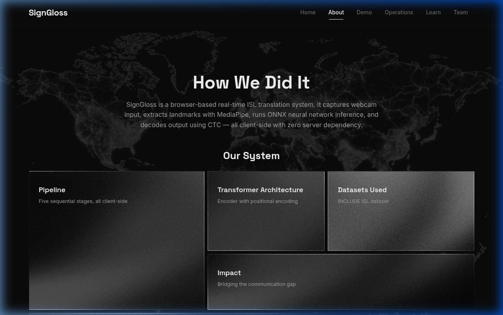
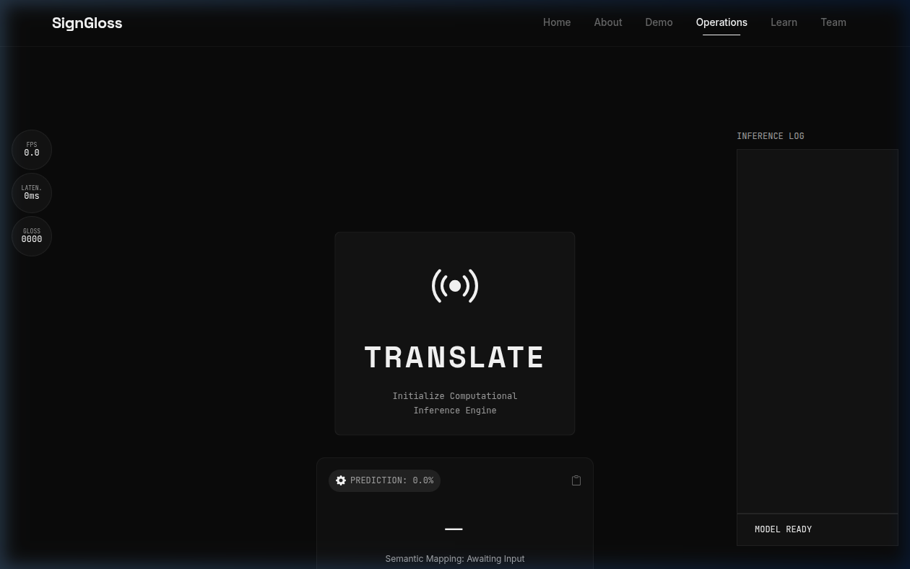
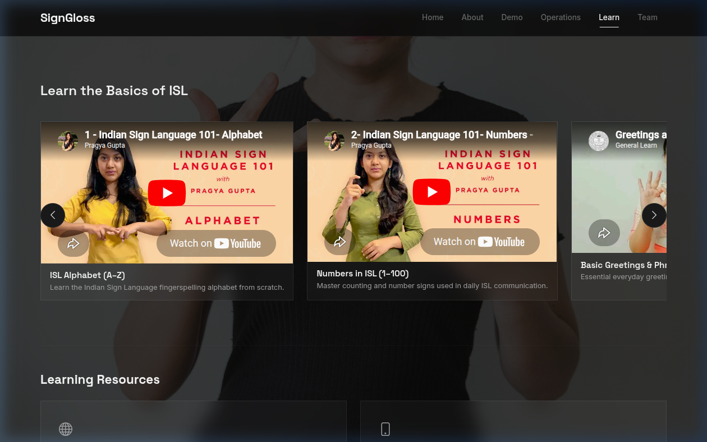

# SignGloss

Real-time Indian Sign Language to gloss translation that runs entirely in the browser.

---

## Overview

SignGloss is a web app that translates Indian Sign Language (ISL) into text (gloss tokens) using your webcam. Everything runs client-side — no backend, no data leaves your device.

It captures video, extracts hand/body landmarks using MediaPipe, runs a transformer model via ONNX Runtime, and decodes the output with CTC decoding. All of this happens in the browser using Web Workers.

---

## Team

| Name | Role |
|---|---|
| Vidyasree Jayaprasad | Capture & Frontend — camera pipeline, MediaPipe integration, UI/UX, page layouts |
| Anand Rodriguez Menon | Inference Pipeline — ONNX model, Web Worker, CTC decoding, model architecture |

---

## Tech Stack

- HTML
- CSS
- JavaScript
- Bootstrap 5
- MediaPipe (landmark detection)
- ONNX Runtime Web (model inference)
- Web Workers
- Google Fonts (Space Grotesk, Inter, JetBrains Mono)

---

## Features

- Real-time ISL to gloss translation via webcam
- MediaPipe hand/body landmark extraction with visual overlay
- ONNX model inference running in a dedicated Web Worker
- CTC decoding for gloss output
- Intro animation on the landing page
- Page transition effects
- Contact form with client-side validation and star rating
- Learn page with embedded ISL tutorial videos
- Responsive design across all pages
- Dark theme UI with glassmorphism elements

---

## Project Structure

```
├── index.html              # Landing page
├── about.html              # How it works
├── demo.html               # Pre-recorded demo video
├── operations.html         # Live translation (camera + inference)
├── learn.html              # Learn ISL signs
├── team.html               # Team + contact form
├── css/
│   └── style.css           # All styles
├── js/
│   ├── common.js           # Shared navbar/footer
│   ├── animations.js       # Scroll animations, counters
│   ├── intro-animation.js  # Landing page intro effect
│   ├── transitions.js      # Page transitions
│   ├── operations-capture.js   # Camera + MediaPipe capture
│   ├── operations-inference.js # Inference UI logic
│   ├── inference-worker.js     # Web Worker for ONNX inference
│   ├── landmarks.js        # Landmark extraction
│   ├── decoder.js          # CTC decoding
│   ├── bridge.js           # Capture-inference data bridge
│   └── contract.js         # Data contract definitions
├── models/
│   └── signgloss_stub.onnx # ONNX model file
├── assets/
│   ├── background.jpg
│   ├── images/
│   ├── videos/
│   └── screenshots/
└── scripts/
    └── generate_stub_model.py
```

---

## Screenshots

### Homepage


### About


### Operations (Live Translation)


### Learn


---

## Running the Project

1. Clone or download the repo
2. Serve it with any local server (Live Server, `python -m http.server`, etc.)
3. Open `index.html` in a browser
4. Go to the Operations page and allow camera access to start translating

---

## Notes

- Needs a local server — opening `index.html` directly as a file won't work because of CORS and module imports
- Requires a webcam for the live translation feature
- Works best on Chrome or Edge (WebRTC + WASM support)
- The `models/` folder must contain the ONNX model file